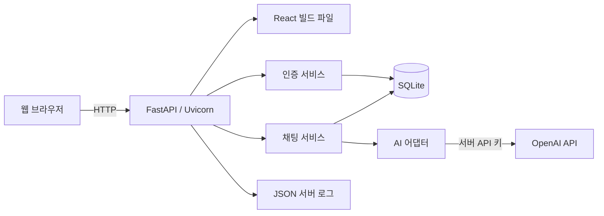
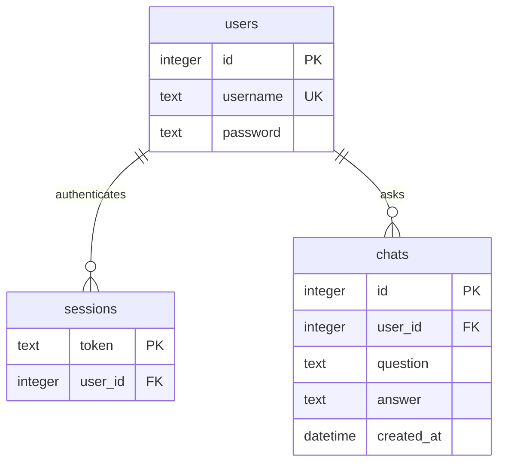
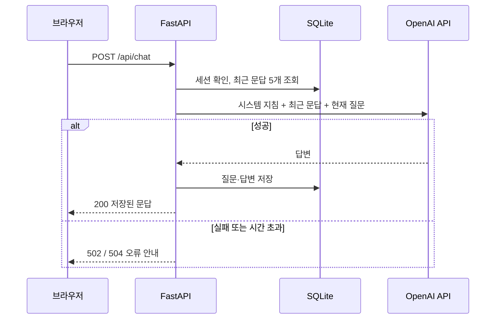

# B7-1 서비스 및 시스템 설계

- 작성일: 2026-10-05
- 기준: [B7-1 과제 요구사항](B7-1.md)
- 실행·배포 절차는 [README](../README.md)를 기준으로 한다.

## 1. 프로젝트 개요

- **문제 정의**: 학습 중 생긴 질문을 바로 묻고, 이전 질문의 맥락을 이어 가며, 나중에 답변을 다시 찾아보기 어렵다.
- **타겟 사용자**: 개념 설명과 간단한 질의응답이 필요한 학습자.
- **핵심 시나리오**
  1. 회원가입 후 로그인한다.
  2. “FastAPI에서 라우터가 뭐야?”라고 질문하고 같은 화면에서 답변을 확인한다.
  3. “간단한 예시도 보여줘”라고 이어서 질문한다. 서버가 최근 문답을 문맥으로 함께 보낸다.
  4. 로그아웃 후 다시 로그인해 이전 질문과 답변을 확인한다.
  5. AI 응답이 실패하거나 지연되면 오류 안내를 보고 다시 질문한다.

## 2. 시스템 구조



| 컴포넌트 | 파일 | 역할 |
| --- | --- | --- |
| 앱 조립 | `app/main.py` | 요청 로그, 예외 → 오류 응답 변환, 시작 시 테이블 생성, 정적 파일 |
| 라우트 | `app/routes.py` | API 경로, 입력 검증, 로그인 확인 의존성, 세션 쿠키 |
| 인증 서비스 | `app/services/auth.py` | 가입, 비밀번호 검증, 세션 발급·조회·삭제 |
| 채팅 서비스 | `app/services/chat.py` | 최근 문맥 조회 → AI 호출 → 문답 저장, 내 로그 조회 |
| AI 어댑터 | `app/services/ai.py` | OpenAI 호출, 시간 제한, 오류 분류 |
| DB | `app/models.py`, `app/database.py` | 테이블 정의, 세션, 저장 성공·실패 로그 |
| 화면 | `frontend/src/` | 로그인·회원가입 화면, 채팅 화면 |

React 화면은 Vite로 빌드하고 FastAPI가 `/`와 `/assets`로 제공한다. 운영은 인스턴스 1대에서 Docker Compose로 앱을 80 포트에 실행한다.

## 3. 인증 및 접근 제어

1. 아이디와 비밀번호는 필수다. 비밀번호는 평문으로 저장하므로 실제 비밀번호를 쓰지 않도록 안내한다.
2. 로그인하면 난수 세션 토큰을 `sessions`에 저장하고 `session` 쿠키로 발급한다.
3. `/api/chat`, `/api/me/chats`는 쿠키의 세션으로 사용자를 찾고, 없으면 `401`을 반환한다.
4. 사용자 ID는 세션에서만 결정한다. 요청 본문의 사용자 정보는 받지 않으므로 다른 사용자의 로그를 조회할 수 없다.
5. 로그아웃하면 세션을 삭제하고 쿠키를 만료시킨다.
6. 화면은 시작 시 `/api/me/chats`를 호출해 `401`이면 로그인 화면, 성공하면 채팅 화면을 보여 준다.

## 4. DB 구조



| 테이블 | 필드 설명 |
| --- | --- |
| `users` | 계정. `username`은 중복 불가, `password`는 평문 |
| `sessions` | 로그인 세션. 쿠키 토큰과 사용자 연결 |
| `chats` | 대화 로그. 사용자 식별(`user_id`), 생성 시각(`created_at`, UTC), 질문, 응답 |

AI 응답에 성공한 문답만 `chats`에 저장한다. 시간은 UTC로 저장하고 API는 `Z`가 붙은 ISO 8601로 반환한다.

## 5. 질문 처리와 문맥 유지



- **문맥 전략**: 같은 사용자의 최근 문답 최대 5쌍을 오래된 순서로 보내고 현재 질문을 붙인다.
- **입력 검증**: 질문은 앞뒤 공백을 제거한 뒤 1~2,000자여야 한다. 위반 시 `422`이며 AI를 호출하지 않는다.
- **시간 제한**: OpenAI 호출은 `AI_TIMEOUT_SECONDS`(기본 30초) 제한, 자동 재시도 0회.

## 6. API 명세

| 메서드 | 경로 | 인증 | 요청 / 성공 응답 |
| --- | --- | --- | --- |
| POST | `/api/auth/signup` | 불필요 | `{username, password}` / `204` |
| POST | `/api/auth/login` | 불필요 | `{username, password}` / `204` + `session` 쿠키 |
| POST | `/api/auth/logout` | 불필요 | 본문 없음 / `204` |
| POST | `/api/chat` | 필요 | `{question}` / `200 {id, question, answer, created_at}` |
| GET | `/api/me/chats` | 필요 | `200 [{id, question, answer, created_at}, ...]`, 오래된 순 |

질문 요청 예시:

```http
POST /api/chat
Content-Type: application/json
Cookie: session=<로그인 시 발급된 토큰>

{"question": "FastAPI에서 라우터가 뭐야?"}
```

성공 응답 예시:

```json
{
  "id": 101,
  "question": "FastAPI에서 라우터가 뭐야?",
  "answer": "라우터는 요청 경로와 이를 처리하는 함수를 연결합니다.",
  "created_at": "2026-10-05T01:00:02Z"
}
```

오류 응답 예시:

```json
{
  "error": {
    "code": "AI_TIMEOUT",
    "message": "현재 응답이 지연되고 있어요. 잠시 후 다시 시도해 주세요."
  }
}
```

## 7. 오류 처리와 운영 로그

| 상황 | HTTP / 코드 |
| --- | --- |
| 로그인 필요 | `401 AUTH_REQUIRED` |
| 잘못된 아이디·비밀번호 | `401 INVALID_CREDENTIALS` |
| 아이디 중복 | `409 USERNAME_ALREADY_EXISTS` |
| 빈 질문·길이 초과 | `422 VALIDATION_ERROR` |
| AI 시간 초과 | `504 AI_TIMEOUT` |
| AI 인증·요청 제한·네트워크 오류·빈 응답 | `502 AI_UNAVAILABLE` |
| DB 오류 | `503 DB_UNAVAILABLE` |
| 그 밖의 서버 오류 | `500 INTERNAL_ERROR` |

모든 예외는 위 형식의 JSON 응답으로 바뀌므로 AI나 DB가 실패해도 서버는 계속 동작한다. 화면은 오류 메시지를 입력창 아래에 표시하고 입력한 질문을 유지한다.

서버 로그는 요청마다 같은 `request_id`가 붙는 JSON 한 줄로 출력한다.

```text
{"event": "request_received", "request_id": "abc123", "method": "POST", "path": "/api/chat"}
{"event": "ai_call_start", "request_id": "abc123", "user_id": 12}
{"event": "ai_call_success", "request_id": "abc123", "user_id": 12, "latency_ms": 1240}
{"event": "db_save_success", "request_id": "abc123", "phase": "chat", "user_id": 12, "chat_id": 987}
```

실패 시에는 `ai_call_failed`(오류 코드), `ai_provider_error`(OpenAI 오류 분류), `db_save_failed`, `request_failed`를 남긴다. 질문·답변·비밀번호·API 키는 로그에 남기지 않는다.

## 8. 디렉터리 구조

```text
app/
  main.py          # 앱 생성, 요청 로그, 예외 처리
  routes.py        # API 라우트, 로그인 확인
  config.py        # 환경 변수
  database.py      # DB 연결, 테이블 생성, 저장 로그
  models.py        # users / sessions / chats
  schemas.py       # 입력·출력 스키마
  errors.py        # 오류 코드·메시지·HTTP 상태
  logging.py       # JSON 로그
  services/        # auth / chat / ai
frontend/src/      # App, AuthPage, ChatPage, api, styles
scripts/check_logs.sql
tests/             # pytest API 테스트
Dockerfile, compose.yaml
```

## 9. 협업 방식

- `main`은 배포 가능한 상태로 유지하고 기능 브랜치(`feature/auth`, `feature/chat`, `feature/ui`, `chore/deploy` 등)에서 작업한다.
- 기능 브랜치 → PR → 다른 팀원 검토 → merge commit으로 통합해 개인 커밋이 이력에 남게 한다.
- 팀원별 역할과 개인 작업 요약, 대표 커밋·PR 링크는 [팀 문서](team.md)에 기록한다.
