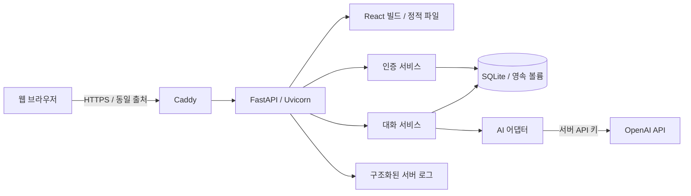
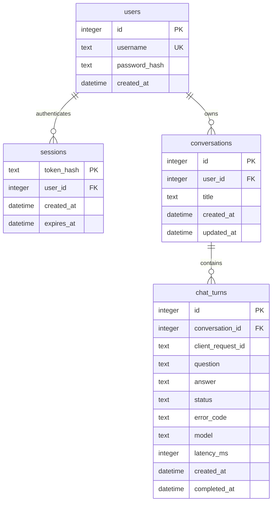
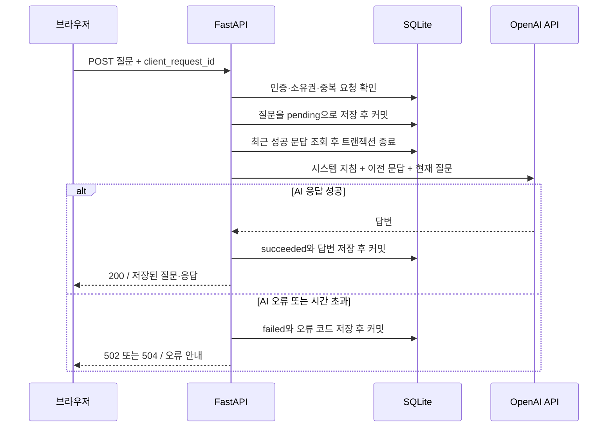

# B7-1 서비스 및 시스템 설계

- 작성일: 2026-10-02
- 기준: [B7-1 과제 요구사항](B7-1.md)
- 상태: 초기 구현 반영. 실행·배포 절차는 [README](../README.md)를 기준으로 한다. 실제 OpenAI 연결·외부 배포·팀 협업 실적은 별도 검증이 필요하다.

## 1. 서비스 목표와 범위

**로그인한 사용자가 AI에 질문하고, 이어서 질문하거나 이전 대화를 다시 확인할 수 있는 웹 서비스**를 만든다.

대상 사용자는 학습 중 개념 설명이나 간단한 질의응답이 필요한 사용자다. 질문할 때마다 배경을 다시 설명해야 하는 불편을 줄이고, 답변을 나중에 다시 찾아볼 수 있게 한다. 특정 분야나 외부 자료 검색이 없는 일반 학습 Q&A를 초기 서비스로 가정한다.

핵심 시나리오:

1. 회원가입 후 로그인한다.
2. 새 대화를 만들고 “FastAPI에서 라우터가 뭐야?”라고 질문한다.
3. 같은 화면에서 답변을 확인하고 “간단한 예시도 보여줘”라고 이어서 질문한다.
4. 로그아웃 후 다시 로그인해 이전 질문과 응답을 확인한다.
5. AI 응답이 실패하면 안내를 확인하고 명시적으로 다시 시도한다.

| 구분 | 범위 |
| --- | --- |
| 필수 구현 | 회원가입·로그인·로그아웃, 인증된 질문, 문맥 유지, DB 저장, 내 기록 조회, 입력 검증, 예외·운영 로그, 외부 배포 |
| 필수 구현을 돕는 기능 | 대화방 생성·목록, 응답 대기 표시, 실패 후 재시도, DB 확인 SQL |
| 이후 확장 | 응답 스트리밍, Markdown 렌더링, 대화 삭제·검색, 관리자 화면, 소셜 로그인, 파일 업로드, RAG, 메신저 연동 |

실시간 응답은 최초 버전에서 HTTP 요청 한 번으로 답변 전체를 받아 같은 화면에 표시하는 방식으로 충족한다. 스트리밍은 완료 기준에 포함하지 않는다.

## 2. 기술 구성과 선택 이유

| 영역 | 선택 | 목적 |
| --- | --- | --- |
| 서버 | Python + FastAPI + Uvicorn | 과제 필수 조건, API와 HTML을 한 서비스에서 제공 |
| 화면 | React + TypeScript + React Router | 화면·컴포넌트·상태·경로를 분리 |
| 프런트 빌드 | Vite + Node.js 24 + pnpm | 타입 검사, 개발 자동 반영, 정적 파일 빌드 |
| 데이터 | SQLite + SQLAlchemy + Alembic | 파일 기반 영속 저장, 모델 정의와 스키마 변경 이력 관리 |
| DB 비동기 접근 | SQLAlchemy AsyncSession + aiosqlite | 요청별 세션 분리, AI 호출과 DB 작업의 경계 명확화 |
| 인증 | 서버 저장형 세션 + HttpOnly 쿠키 | 로그인 상태 확인, 만료·로그아웃 시 서버에서 폐기 |
| 비밀번호 | Argon2id 해시 | 평문 비밀번호를 저장하지 않음 |
| AI | OpenAI API + 서버 전용 어댑터 | OpenAI 요청·응답·오류 변환을 한 파일에 격리 |
| 검증 | pytest + HTTPX + 임시 SQLite | 인증·소유권·대화·실패 경로 검증 |
| 배포 | Linux 인스턴스 1대 + Docker Compose + Caddy | 인스턴스에서 HTTPS, 앱 실행, DB 볼륨을 한 배포 단위로 관리 |

React 화면을 Vite로 빌드하고 FastAPI가 진입 HTML과 `/assets`를 제공한다. 운영에서는 화면과 API가 같은 출처를 사용한다. 개발 시 Vite 5173의 `/api` 프록시를 사용하고 FastAPI의 `APP_ORIGIN`을 `http://localhost:5173`으로 지정한다. [Vite 문서](https://vite.dev/guide/)

AI 공급자는 **OpenAI**로 확정하며, 최초 구현은 OpenAI API만 지원한다. 모델은 팀 계정의 사용 가능 모델과 예산에 따라 선정하고 `AI_MODEL`로 설정한다. API 키는 공식 SDK의 환경 변수 이름인 `OPENAI_API_KEY`로 서버에 주입한다. [OpenAI 공식 빠른 시작 문서](https://developers.openai.com/api/docs/quickstart)

배포는 **Linux 인스턴스 1대에 Docker Compose로 구성**한다. `compose.yaml`에서 앱과 Caddy, 영속 볼륨을 관리한다. 인스턴스 제공 업체·사양·도메인은 배포 준비 시 확정한다. 정확한 패키지 버전은 초기 실행 검증 후 의존성 파일에 고정한다.

## 3. 시스템 구조



- **라우터**: 입력 검증, 인증 의존성 적용, HTTP 응답 변환.
- **인증 서비스**: 사용자 생성, 비밀번호 검증, 세션 발급·조회·폐기.
- **대화 서비스**: 대화 소유권 확인, 요청 중복 확인, 문맥 조립, AI 호출, 결과 저장.
- **AI 어댑터**: OpenAI API 호출, 전체 호출 시간 제한, 결과 정규화, 오류 분류.
- **DB 계층**: SQLAlchemy 모델과 요청별 세션. 초기에는 별도 Repository 계층을 만들지 않는다.
- **공통 계층**: 설정, 요청 식별자, 로그, 예외 처리.

운영 앱은 **인스턴스 1개·Uvicorn worker 1개**로 시작한다. 사용자 요청은 비동기로 처리하되 SQLite 쓰기 트랜잭션은 짧게 유지한다. 여러 서버로 확장해야 할 때 PostgreSQL 전환을 검토한다.

## 4. 화면과 사용자 흐름

| 화면 | URL | 구성 및 동작 |
| --- | --- | --- |
| 회원가입 | `/signup` | 아이디·비밀번호 입력, 검증 안내, 완료 후 로그인으로 이동 |
| 로그인 | `/login` | 로그인 실패 안내, 성공 후 `/chat` 이동 |
| 채팅 | `/chat` | 대화 목록, 새 대화, 메시지 영역, 질문 입력, 전송, 로그아웃 |

```text
┌──────────────────────────────────────────────────────┐
│ B7-1 챗봇                              사용자 / 로그아웃 │
├────────────────┬─────────────────────────────────────┤
│ [+ 새 대화]    │ FastAPI 학습                          │
│                │                                     │
│ FastAPI 학습   │ 나: 라우터가 뭐야?                    │
│ SQL 질문      │ AI: 요청 경로와 처리 함수를 연결해요.  │
│                │                                     │
│                │ [질문을 입력하세요...        ] [전송] │
└────────────────┴─────────────────────────────────────┘
```

- 모바일에서는 대화 목록을 접을 수 있게 한다. 입력에는 레이블을 제공하고 처리 상태는 `aria-live` 영역에 표시한다.
- 입력 전: 공백뿐인 질문은 전송할 수 없고 2,000자 제한을 표시한다.
- 전송 중: 현재 대화의 전송 버튼을 비활성화하고 “답변을 생성하고 있어요”를 표시한다.
- 성공: 저장된 질문·응답과 시각을 표시한다. AI 출력은 `textContent`로 렌더링한다.
- 실패: 해당 질문에 오류 안내와 재시도 버튼을 표시한다. 실패 안내를 AI 답변으로 취급하지 않는다.
- 통신 끊김: 처리 결과가 불명확하다고 안내하고 기록을 재조회한다. 확인 전에는 새 요청으로 자동 재전송하지 않는다. 기록이 없으면 사용자가 결과 확인 버튼을 눌러 같은 UUID로 확인한다. `pending`은 2초마다 최대 120초 조회한 뒤 수동 확인으로 전환한다.
- 인증 만료: API의 `401`을 받으면 로그인으로 이동한다.
- HTML `/chat` 비인증 요청은 로그인으로 리다이렉트하고, API 비인증 요청은 JSON `401`로 응답한다.

## 5. 인증 및 접근 제어

1. 새 가입 아이디는 영문·숫자·밑줄(`_`) 3~32자로 제한한다. 앞뒤 공백 제거·소문자 정규화 후 유일하게 저장한다.
2. 비밀번호는 조합 조건 없이 10~128자로 검증하고 Argon2id 해시만 저장한다. 비밀번호를 임의로 trim하지 않는다.
3. 로그인 성공 시 암호학적 난수 32바이트 이상의 세션 토큰을 새로 발급한다.
4. 브라우저에는 토큰을 쿠키로, DB에는 토큰의 SHA-256 해시와 사용자·만료 시각을 저장한다.
5. 쿠키는 `HttpOnly`, `SameSite=Lax`, `Path=/`, 운영 환경에서 `Secure`를 적용한다. 만료는 발급 후 24시간으로 고정한다.
6. 매 요청에서 세션 만료와 사용자 존재 여부를 확인한다. 로그아웃 시 DB 세션을 삭제하고 쿠키도 만료시킨다.
7. 사용자 ID는 인증 세션에서 결정한다. 요청 본문의 사용자 ID를 신뢰하지 않으며 대화 생성 API에도 받지 않는다.
8. 대화 조회·질문 시 항상 `conversation.id`와 `conversation.user_id`를 함께 조회한다. 타인의 대화는 존재하지 않는 대화와 동일하게 `404`로 응답한다.

쿠키 속성과 세션 발급·만료 정책은 [OWASP 세션 관리 지침](https://cheatsheetseries.owasp.org/cheatsheets/Session_Management_Cheat_Sheet.html)을 참고한다.

CSRF 방어는 모든 상태 변경 API에 적용한다. 회원가입·로그인을 포함해 `Origin`이 설정된 `APP_ORIGIN`과 정확히 같아야 하며, 누락·불일치는 `403`으로 거부한다. JSON 본문이 있는 API는 `application/json`만 받는다. 프런트는 같은 출처의 Fetch로 호출하며 외부 출처 CORS는 허용하지 않는다. CLI 평가 요청에도 `Origin`을 명시한다. 이 정책은 [OWASP의 출처 확인 지침](https://cheatsheetseries.owasp.org/cheatsheets/Cross-Site_Request_Forgery_Prevention_Cheat_Sheet.html)을 참고한 설계다.

로그인 실패 메시지는 계정 존재 여부를 구분하지 않는다. 초기 요청 제한은 로그인 IP당 분당 10회, AI 질문 사용자당 분당 10회로 잡고 `429`로 안내한다. 단일 프로세스 메모리 기반 제한으로 시작하며 재시작 시 초기화됨을 운영 문서에 명시한다.

## 6. DB 설계



`chat_turns` 한 행은 질문 한 번과 그 처리 결과를 표현한다. 최초에는 질문과 `pending` 상태만 저장하고, 결과가 확정되면 같은 행을 갱신한다. 사용자 식별은 `chat_turns → conversations → users` 관계로 추적한다.

| 항목 | 규칙 |
| --- | --- |
| `question` | 필수, 앞뒤 공백 제거 후 1~2,000자 |
| `answer` | 성공 시 비어 있지 않은 문자열, 대기·실패 시 NULL |
| `status` | `pending`, `succeeded`, `failed` 중 하나, CHECK 제약 |
| `error_code` | 실패 시 필수, 대기·성공 시 NULL |
| `completed_at` | 성공·실패 시 필수, 대기 시 NULL |
| `model`, `latency_ms` | 기록 가능한 경우 저장, NULL 허용 |
| `client_request_id` | 프런트가 생성하는 UUID, `(conversation_id, client_request_id)` UNIQUE |
| 대화 제목 | 초기 “새 대화”, 첫 질문의 앞 30자로 확정 |
| 시간 | UTC로 저장하고 API는 `Z`가 있는 ISO 8601로 반환, 화면에서 현지 시간으로 변환 |

추가 인덱스는 `conversations(user_id, updated_at, id)`, `chat_turns(conversation_id, id)`, `sessions(expires_at)`로 둔다. `chat_turns(conversation_id) WHERE status='pending'` 부분 UNIQUE 인덱스로 대화방당 진행 중인 요청을 하나로 제한한다. 상태별 NULL 규칙도 CHECK 제약으로 보장한다.

연결마다 `foreign_keys=ON`, `busy_timeout=5000`을 설정하고 초기화 시 WAL 모드를 적용한다. WAL에서도 동시 쓰기는 하나이므로 AI 응답을 기다리며 DB 트랜잭션을 유지하지 않는다. SQLite 파일과 WAL 파일은 같은 서버의 로컬 영속 볼륨에 둔다. [SQLite WAL 문서](https://www.sqlite.org/wal.html)

## 7. 질문 처리와 문맥 유지



문맥 구성 규칙:

- 서버에 고정한 시스템 지침 + **동일 대화방의 최근 성공 문답 최대 5쌍** + 현재 질문 순서로 구성한다.
- 이전 문답은 ID 기준으로 최근 데이터를 선택한 뒤 오래된 순서로 정렬한다. 실패·대기 문답은 제외한다.
- 이전 문답의 질문·응답 합계는 최대 12,000자로 제한한다. 초과하면 가장 오래된 문답부터 쌍 단위로 제외한다.
- 현재 질문은 최대 2,000자, 모델 출력은 최대 1,000토큰으로 설정한다.
- 문자 수 제한은 비용·크기 제한의 1차 기준이다. tiktoken으로 본문 토큰을 계산하고 메시지 형식과 출력 여유를 예약해 오래된 문답을 추가 제거한다. API 집계와의 차이를 고려해 `AI_CONTEXT_WINDOW_TOKENS`는 선택 모델의 한도 이하로 보수적으로 설정한다.
- 모든 이전 문답을 제거해도 한도를 넘으면 `422 CONTEXT_TOO_LARGE`로 실패 기록을 남기고 AI를 호출하지 않는다.
- 서버 DB에서 문맥을 만들며, 클라이언트가 보낸 과거 메시지나 시스템 지침은 받지 않는다.

AI 전체 호출 제한은 30초, 자동 재시도는 0회로 둔다. 어댑터 전체에 시간 제한을 적용하며 공급자 SDK의 기본 재시도도 비활성화한다. 브라우저 대기 제한은 45초, 프록시 응답 대기는 60초로 잡는다.

중복 및 중단 처리:

- 같은 키·같은 질문으로 재전송하면 성공 결과를 재사용한다. 실패한 키는 기존 오류를 반환하며 AI를 다시 호출하지 않는다.
- 같은 키에 다른 질문을 보내면 `409 IDEMPOTENCY_CONFLICT`, 진행 중인 키 또는 다른 진행 중 요청이 있으면 `409 CHAT_IN_PROGRESS`를 반환한다.
- 확인된 실패 후 사용자가 누르는 재시도는 새 UUID를 만든다. 중복 전송과 의도적인 재시도를 구분한다.
- 동시 삽입의 UNIQUE 충돌은 롤백 후 기존 행을 다시 조회해 위 규칙으로 처리한다.
- 요청 취소를 감지하면 가능한 경우 `REQUEST_INTERRUPTED`로 실패를 저장한다. 프로세스 종료처럼 정리가 불가능한 경우를 위해 시작 시 남은 `pending`을 실패로 복구한다.
- 실행 중에는 15초마다 90초 이상 지난 `pending`을 실패 처리한다. 정상 완료와 복구 모두 `WHERE status='pending'` 조건으로 갱신해 이미 확정된 결과를 덮어쓰지 않는다. 갱신 후 저장된 상태를 다시 확인하므로 복구가 먼저 완료되면 늦은 성공 응답도 기존 실패 결과를 반환한다.
- 이 방식은 중복 AI 호출을 줄이지만 공급자 호출과 DB 기록 사이의 정확히 한 번 실행을 보장하지 않는다. DB 저장 실패 뒤 새 키로 재시도하면 추가 호출 비용이 발생할 수 있다.

## 8. API 계약

API 접두사는 `/api`로 한다. 인증은 세션 쿠키를 사용하며 인증 필요 API에서 세션이 없거나 만료되면 `401`로 응답한다.

| 메서드 | 경로 | 인증 | 요청 / 성공 응답 |
| --- | --- | --- | --- |
| POST | `/api/auth/signup` | 불필요 | `{username, password}` / `201 {id, username}` |
| POST | `/api/auth/login` | 불필요 | `{username, password}` / `200 {id, username}` + 세션 쿠키 |
| POST | `/api/auth/logout` | 필요 | 본문 없음 / `204`, 세션 폐기 |
| GET | `/api/me` | 필요 | `200 {id, username}` |
| POST | `/api/conversations` | 필요 | `{}` / `201 {id, title, created_at}` |
| GET | `/api/conversations?limit=20&offset=0` | 필요 | `200 {items, limit, offset}`, `updated_at DESC, id DESC` |
| GET | `/api/conversations/{id}/turns?limit=50&before_id=100` | 필요 | `200 {items, next_before_id}`, 최근 페이지를 선택 후 ID 오름차순 표시 |
| POST | `/api/conversations/{id}/messages` | 필요 | `{question, client_request_id}` / `200` 저장된 문답 |
| GET | `/api/me/chats?limit=20&before_id=100` | 필요 | `200 {items, next_before_id}`, 내 전체 문답을 ID 내림차순 조회 |
| GET | `/health/live` | 불필요 | `200 {status: "ok"}` |
| GET | `/health/ready` | 불필요 | DB 조회·필수 설정 검사 성공 `200`, 실패 `503` |

페이지 크기는 1~100, offset은 0 이상으로 제한한다. `before_id`는 선택 사항이며 해당 ID 미만만 선택한다. 다음 페이지가 없으면 `next_before_id`는 NULL이다. 문답 목록에는 성공·실패·대기 상태를 모두 포함한다.

질문 요청 예시:

```http
POST /api/conversations/12/messages
Content-Type: application/json
Origin: https://chat.example.com
Cookie: session=<로그인 시 발급된 토큰>

{
  "question": "FastAPI에서 라우터가 뭐야?",
  "client_request_id": "83961cc9-28b5-45ea-8c2b-e6b85cf9f833"
}
```

성공 응답 예시:

```json
{
  "id": 101,
  "conversation_id": 12,
  "client_request_id": "83961cc9-28b5-45ea-8c2b-e6b85cf9f833",
  "question": "FastAPI에서 라우터가 뭐야?",
  "answer": "라우터는 요청 경로와 이를 처리하는 함수를 연결합니다.",
  "status": "succeeded",
  "error_code": null,
  "created_at": "2026-10-02T01:00:00Z",
  "completed_at": "2026-10-02T01:00:02Z"
}
```

문답 조회의 `items`도 위 필드를 사용한다. 대기·실패는 `answer: null`이며 실패 시 `error_code`를 포함한다. 사용자에게 표시할 안내 문구는 오류 코드에 따라 UI에서 결정한다.

모든 오류는 다음 형태로 통일한다. 프레임워크 입력 검증 오류도 같은 구조로 변환한다. `request_id`는 서버가 HTTP 요청마다 생성하는 운영 추적용 ID이고, `client_request_id`는 저장되는 중복 방지 키다.

```json
{
  "error": {
    "code": "AI_TIMEOUT",
    "message": "현재 응답이 지연되고 있어요. 잠시 후 다시 시도해 주세요.",
    "request_id": "req_7f402a",
    "turn_id": 102
  }
}
```

`turn_id`는 DB 행 생성 전 오류에서는 NULL이다. 응답 헤더에도 `X-Request-ID`를 넣는다.

## 9. 실패 처리와 운영 로그

| 상황 | HTTP / 코드 | DB 및 UI 처리 |
| --- | --- | --- |
| 아이디 중복 | `409 USERNAME_ALREADY_EXISTS` | 계정 생성 취소, 입력 안내 |
| 잘못된 로그인·만료 | `401 AUTH_REQUIRED` 또는 `INVALID_CREDENTIALS` | 재로그인 안내 |
| 출처 검증 실패 | `403 ORIGIN_REJECTED` | 상태 변경 실행 안 함 |
| 다른 사용자 대화·없는 대화 | `404 CONVERSATION_NOT_FOUND` | 접근 불가 안내 |
| 빈 질문·길이·형식 오류 | `422 VALIDATION_ERROR` | AI 호출 및 문답 생성 안 함 |
| 입력 토큰 한도 초과 | `422 CONTEXT_TOO_LARGE` | 해당 문답 실패 저장 |
| 중복 키 내용 충돌·진행 중 | `409 IDEMPOTENCY_CONFLICT` 또는 `CHAT_IN_PROGRESS` | 재조회 안내, 추가 AI 호출 안 함 |
| 서비스 요청 제한 | `429 RATE_LIMITED` | `Retry-After`와 대기 안내 |
| AI 시간 초과 | `504 AI_TIMEOUT` | 실패 저장, 수동 재시도 |
| AI 인증·요청 제한·네트워크 오류·빈 응답 | `502 AI_UNAVAILABLE` | 실패 저장, 원인 분류는 내부 로그에 기록 |
| DB 오류 | `503 DB_UNAVAILABLE` | 롤백, 저장 결과를 보장할 수 없다는 안내 |
| 중단된 요청의 기존 키 재조회 | `409 REQUEST_INTERRUPTED` | 새 요청으로 재시도 안내 |
| 처리되지 않은 서버 오류 | `500 INTERNAL_ERROR` | 내부 상세를 숨기고 요청 ID로 추적 |

**성공 응답은 DB 커밋이 끝난 뒤 반환한다.** 최초 질문 저장이 실패하면 AI를 호출하지 않는다. AI 성공 후 답변 저장이 실패하면 성공으로 응답하지 않고 `DB_UNAVAILABLE`을 반환한다. 실패 상태 저장까지 실패한 경우에도 서버 로그는 남기며 잔여 `pending`은 복구 대상으로 처리한다.

로그 이벤트:

```text
request_received request_id=req_7f402a method=POST path=/api/conversations/12/messages
ai_call_start request_id=req_7f402a user_id=3 conversation_id=12 turn_id=102
ai_call_success request_id=req_7f402a turn_id=102 latency_ms=1240
db_save_success request_id=req_7f402a turn_id=102 phase=result status=succeeded
request_completed request_id=req_7f402a status_code=200 latency_ms=1290
```

실제 구현은 JSON 구조화 로그로 출력한다. `db_save_success`는 최초 질문 저장과 최종 상태 저장에 각각 남기고 `phase`로 구분한다. 실패 이벤트는 `ai_call_failed`, `db_save_failed`를 사용한다. 세션·계정 저장에도 DB 성공·실패 이벤트를 남긴다.

API 키, 비밀번호, 세션 원문, 공급자 응답 원문은 로그에 남기지 않는다. 질문·답변은 DB에 보관하고 운영 로그에는 식별자와 상태만 남긴다. 공급자 예외는 원문을 그대로 출력하지 않고 분류한 오류 코드와 안전한 메타데이터만 기록한다.

## 10. 디렉터리 구조

```text
app/
  main.py                  # 앱 생성, 라우터, lifespan, 정적 파일
  config.py                # 환경 변수 검증
  database.py              # 엔진, 세션, SQLite 설정
  models.py                # users / sessions / conversations / chat_turns
  schemas.py               # 입력·출력·오류 스키마
  dependencies.py          # 인증 사용자·DB·설정·AI 의존성 주입
  routers/
    __init__.py            # /api 및 페이지·health 라우터 등록
    pages.py               # React 진입 HTML, 직접 접속 세션 확인
    auth.py                # 가입·로그인·로그아웃
    conversations.py       # 대화 생성·목록·문답 API
    me.py                  # 내 정보·전체 대화 기록
    health.py
  services/
    auth.py                # 비밀번호, 세션 수명
    conversations.py       # 대화 소유권·생성·페이지 조회
    chat.py                # 상태 전이, 문맥, 중복 방지
    ai.py                  # OpenAI API 연동, 타임아웃
  middleware.py            # 요청 ID, 출처 검사, 운영 로그
  errors.py                # 공통 오류 변환
frontend/
  package.json             # pnpm 명령, 프런트 의존성
  pnpm-lock.yaml           # 프런트 의존성 버전 고정
  vite.config.ts           # React 빌드, 개발 API 프록시
  src/
    main.tsx               # React 진입점
    App.tsx                # /login, /signup, /chat 라우팅
    api/                   # HTTP 통신, API 타입, 오류
    components/            # 브랜드, 인증 보호
    pages/                 # AuthPage / ChatPage
    chat/
      useChat.ts           # 비동기 흐름, pending polling 수명
      state.ts             # 순수 상태 전이, 응답 병합, 경합 방어
      Sidebar.tsx          # 대화 목록, 계정
      TurnList.tsx         # 문답 및 오류 렌더링
      Composer.tsx         # 질문 입력
      Welcome.tsx          # 시작 안내
    styles/                # base / auth / chat CSS
  dist/                    # 생성된 빌드 결과, Git 제외
migrations/                # Alembic 스키마 이력
scripts/
  check_logs.sql           # 평가용 읽기 쿼리
tests/                     # 인증·소유권·채팅·실패 검증
docs/
  B7-1.md                  # 과제 원문
  design.md                # 본 설계
  team.md                  # 실제 역할, 개인별 작업·PR 링크
.env.example
.gitignore
.dockerignore
pyproject.toml             # 프로젝트와 의존성 정의
uv.lock                    # 검증한 의존성 버전 고정
Dockerfile
compose.yaml
Caddyfile
README.md                  # 실제 실행·배포·평가 절차
```

## 11. 설정과 배포

| 환경 변수 | 용도 / 설계 기본값 |
| --- | --- |
| `APP_ENV` | `development` 또는 `production` |
| `APP_ORIGIN` | 로컬 `http://localhost:8000`, 운영은 실제 HTTPS 출처 |
| `DATABASE_URL` | `sqlite+aiosqlite:///./data/app.db`, 컨테이너에서는 `/data/app.db`를 사용 |
| `OPENAI_API_KEY` | OpenAI API 키, 서버 환경에서만 주입 |
| `AI_MODEL` | 사용할 OpenAI 모델 ID, 모델 선정 후 설정하며 누락 시 시작 실패 |
| `AI_TIMEOUT_SECONDS` | `30` |
| `AI_MAX_OUTPUT_TOKENS` | `1000` |
| `AI_CONTEXT_WINDOW_TOKENS` | `8192`; 선택 모델 한도 이하의 입력·출력 예산 |
| `AI_TOKEN_ENCODING` | 기본 자동 추론; 필요 시 tiktoken 인코딩 명시 |
| `CHAT_CONTEXT_TURNS` | `5` |
| `CHAT_CONTEXT_MAX_CHARS` | `12000` |
| `SESSION_TTL_SECONDS` | `86400` |
| `COOKIE_SECURE` | 로컬 HTTP `false`, 운영에서는 반드시 `true` |
| `LOG_LEVEL` | `INFO` |
| `APP_DOMAIN` | 운영 Compose의 HTTPS 도메인 |

`.env.example`에는 변수 이름·비밀이 아닌 기본값·빈 키만 넣는다. `.gitignore`와 `.dockerignore`에는 `.env`, `.env.*`를 제외하되 `.env.example`은 예외로 둔다. 실제 DB 파일·WAL·백업·쿠키 파일·로그도 커밋 및 이미지 빌드 대상에서 제외한다. 쿠키용 난수 세션은 DB 조회로 검증하므로 별도 JWT 서명 키를 사용하지 않는다.

로컬 실행 절차:

```bash
npm install --global pnpm@12.3.4
pnpm --dir frontend install --frozen-lockfile
pnpm --dir frontend build
uv sync --frozen --extra dev
# 기존 .env가 있다면 복사하지 않는다.
cp .env.example .env
# .env에 OPENAI_API_KEY와 AI_MODEL을 설정한다.
mkdir -p data
uv run --frozen alembic upgrade head
uv run --frozen uvicorn app.main:create_app --factory --reload --no-access-log
```

운영 배포 절차:

1. Linux 인스턴스에 Docker Engine과 Docker Compose를 설치하고 도메인의 DNS를 연결한다. 외부에는 80/443만 공개하고 관리용 SSH 접근은 제한한다.
2. 서버에 저장소를 내려받아 운영 `.env`를 작성한다. 키를 이미지에 포함하지 않는다.
3. Docker의 Node 빌드 단계에서 React를 빌드하고 결과를 Python 이미지에 복사한다. 인스턴스의 `compose.yaml`로 Caddy와 앱을 실행한다. OpenAI API 키는 앱 컨테이너에만 주입한다. 앱은 내부 포트로만 노출하고 Uvicorn worker는 1개로 고정한다.
4. 앱 DB는 `/data` 영속 볼륨에 연결한다. Caddy 인증서 데이터도 영속 볼륨에 보관한다.
5. 최초 배포 및 변경 시 마이그레이션을 먼저 실행하고 앱을 시작한다. 스키마 변경 전에는 SQLite backup API로 백업한다.
6. HTTPS·쿠키·health·실제 AI 응답을 외부 네트워크에서 확인하고 서비스 URL과 GitHub URL을 README에 기록한다.
7. 컨테이너를 재시작한 뒤 로그인과 기존 대화 조회를 확인한다. 평가 기간에는 서버와 AI 계정 사용 가능 상태를 유지한다.

실행 중인 SQLite 파일만 단순 복사하지 않고 backup API로 일관된 백업을 만든다. 복원은 앱을 멈춘 상태에서 수행하고 별도 환경에서 복구 가능성을 확인한다. `/health/ready`는 AI를 호출하지 않으므로 실제 AI 연결은 배포 후 별도 질문으로 검증한다.

## 12. 평가 및 DB 확인 방법

최소 두 사용자 A/B로 아래 항목을 확인한다. 실제 AI API가 필요한 최종 연결 검증 외에는 어댑터를 테스트 대역으로 교체하고 독립된 임시 SQLite를 사용한다.

| 과제 항목 | 완료 기준 / 증빙 |
| --- | --- |
| 4.1 웹 UI | 질문과 응답이 같은 화면에 표시되고 새로고침 후에도 조회됨 |
| 4.2 인증 | 가입·로그인·로그아웃 성공, 비인증 질문 `401`, 만료 세션 거부 |
| 4.2 접근 제어 | A의 대화를 B가 조회·질문하면 `404`, 외부 출처 쓰기 요청 `403` |
| 4.3 AI 처리 | 실제 AI 응답 1회 이상, “방금 뭘 물어봤지?”로 문맥 확인, 다른 대화 문맥 미포함 |
| 4.4 저장·추적 | `/api/me/chats`와 SQL로 사용자·시각·질문·응답 확인 |
| 4.5 검증·예외 | 공백·초과 길이 `422`, AI 오류 `502`, 시간 초과 `504`, 이후 정상 질문 가능 |
| 4.5 DB 장애 | 최초 저장 실패 시 AI 미호출, 결과 커밋 실패 시 성공 응답 없음 |
| 4.5 중복·복구 | 같은 키 재전송 시 추가 AI 호출 없음, 동시 질문 제한, 재시작 후 pending 복구 |
| 4.5 로그 | 요청 ID로 요청·AI 호출 결과·DB 저장 결과를 연결 가능 |
| 4.6 배포 | 외부 HTTPS 접속, 재시작 후 DB 유지, 환경 설정·실행 방법 재현 가능 |
| 4.7 협업 | 기능 브랜치·PR 머지 이력, 팀원 각각 유의미한 커밋 10개 이상 |
| 최종 산출물 | README, API 예시, ERD, 팀 작업 요약, 실제 서비스·저장소 URL |

평가자가 본인 계정으로 로그인한 뒤 호출할 로그 확인 예시:

```http
GET /api/me/chats?limit=20
Cookie: session=<로그인 시 발급된 토큰>
```

서버 담당자가 실행할 `scripts/check_logs.sql`의 쿼리 설계:

```sql
SELECT c.user_id,
       t.id AS turn_id,
       t.conversation_id,
       t.created_at,
       t.question,
       t.answer,
       t.status,
       t.error_code
FROM chat_turns AS t
JOIN conversations AS c ON c.id = t.conversation_id
WHERE c.user_id = :user_id
ORDER BY t.id DESC
LIMIT 20;
```

실제 스크립트 또는 SQLite CLI 안내에 `:user_id` 바인딩 방법을 포함한다. 전체 DB 파일이나 모든 사용자 기록을 외부 공개하는 엔드포인트는 만들지 않는다.

## 13. 120시간 개발 계획과 협업

아래 시간은 과제의 120시간을 단계별로 배분한 계획이다. 팀 전체 인시인지 인당 학습시간인지는 과제 운영 기준에 맞춰 조정하고, 팀 인원·이름은 확정 후 `docs/team.md`에 기록한다.

| 단계 | 시간 | 산출물 / 완료 조건 |
| --- | ---: | --- |
| 1. 범위·설계·기반 구성 | 12h | OpenAI 모델 선정, 앱 실행, DB 마이그레이션, 인스턴스·Compose 초기 배포 |
| 2. 사용자 인증 | 18h | 가입·로그인·로그아웃·출처 검사·접근 제어 검증 |
| 3. 채팅 화면·대화방 | 18h | 반응형 화면, 대화 생성·목록·기록 조회 |
| 4. AI·문맥·저장 | 24h | 실제 응답, 최근 문맥, 상태 전이, 중복 방지 |
| 5. 예외·운영 로그 | 16h | 타임아웃·DB 실패·요청 제한·중단 복구 |
| 6. 통합 검증·운영 배포 | 16h | 사용자 격리, 외부 접속, 영속성·백업 확인 |
| 7. 문서·평가·보완 | 16h | 재현 가능한 README, 개인별 작업 증빙, 시연 |
| **합계** | **120h** | |

4인 팀을 가정한 역할 예시:

| 역할 | 주 담당 | 상호 검토 |
| --- | --- | --- |
| A | 인증·세션·접근 제어 | B의 API·DB 처리 검토 |
| B | 대화 API·DB·AI 연동 | A의 인증·소유권 검토 |
| C | 화면·입력·오류 UX | D와 배포 후 사용자 흐름 검증 |
| D | 배포·로그·통합 검증·문서 | C의 UI·오류 표시 검토 |

테스트와 문서는 각 기능 담당자가 함께 작성하고 D가 통합한다. 인원이 다르면 역할을 합치되 담당자와 검토자를 명시한다.

- `main`은 배포 가능한 상태로 유지한다. `feature/auth`, `feature/chat`, `feature/ui`, `chore/deploy` 등 기능 브랜치에서 작업한다.
- 작업은 이슈 → 기능 브랜치 → PR → 다른 팀원 검토 → main 머지 순서로 진행한다.
- PR에는 동작 변화, 확인 방법, DB·환경 변수 변경 여부를 기록한다.
- 각 팀원은 의미 있는 변경 단위로 최소 10회 커밋한다. 횟수를 채우기 위한 빈 커밋이나 인위적 분할은 하지 않는다.
- 개인 커밋이 main 이력에도 남도록 merge commit 방식으로 통합하고 일괄 squash는 피한다.
- CI에서 임시 DB 마이그레이션과 자동 테스트를 실행한다. CI의 AI는 테스트 대역을 사용해 키와 비용을 요구하지 않는다.
- 실제 이름·담당 기능·대표 커밋·PR 링크·개인 작업 요약을 `docs/team.md`에 누적한다. 설계상의 역할을 완료한 실적으로 기록하지 않는다.

첫 구현 목표는 **회원가입 → 로그인 → 질문 1회 → 실제 AI 응답 → DB 저장 → 내 기록 조회**가 외부 URL에서 이어지는 최소 흐름이다. 이 흐름을 먼저 완성한 뒤 대화방·문맥·예외 경로를 추가한다.
